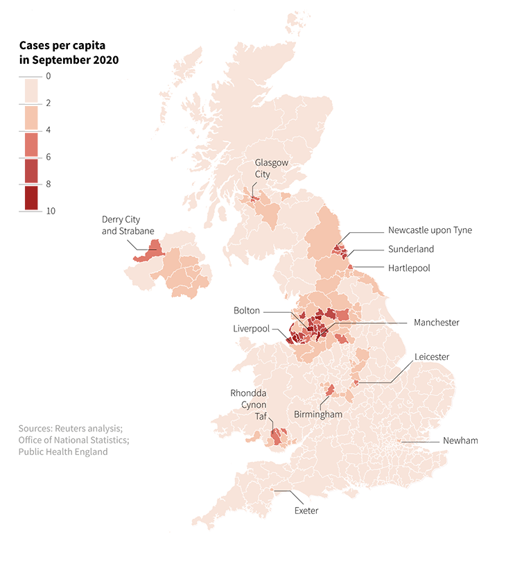

<center>


</center>

### **Introduction of United Kingdom**

The United Kingdom (UK) is an island country located in the northwestern coast of mainland Europe. It consists of England, Scotland, Wales and Northern Ireland. The UK is surrounded by the Atlantic Ocean, the North Sea, the English Channel, and the Irish Sea. London is its capital and largest city.The total area of the United Kingdom is 244,376 km2,with an estimated population of nearly 67.6 million people.The UK is a developed country and has the world's sixth largest economy.It is a founding member of international organizations such as the United Nations and NATO, and it plays a significant role in global politics, finance, and culture.

<br>

### **Coronavirus (COVID-19) pandemic in United Kingdom**

The coronavirus pandemic in the United Kingdom began in early 2020, with the first confirmed cases reported in January. Since COVID-19 spreads most commonly through the air and it is highly contagious disease, the UK government initially responded with measures such as travel restrictions, social distancing guidelines, and eventually, a nationwide lockdown in March 2020 to curb the spread of the virus.

Although UK government take sudden and strict decision, The National Health Service (NHS) faced huge pressure as hospitals and health care facilities were overwhelmed with COVID-19 patients. Therefore they moved to develop a vaccine to control the spreading of COVID-19. The development of COVID-19 vaccines, starting in December 2020, marked a turning point in the pandemic response. The UK was one of the first countries to approve and administer the Pfizer-BioNTech vaccine, followed by the Oxford-AstraZeneca and Moderna vaccines.By 2022, with a significant portion of the population vaccinated, the focus shifted towards living with the virus, and restrictions were gradually eased.

<br>

### **Exploratory Data Analysis** 

<br>

#### **Overview of Data**

The dataset from the "coronavirus" R package, collected by the Center for Systems Science and Engineering (CSSE) at Johns Hopkins University, encompasses COVID-19 data from January 2020 to March 2023. It includes daily reports on new confirmed cases, deaths, and recoveries (until August 2022).

* Data Fields :

  + date: Observation date
  - province: Province/state name (if applicable)
  - country: Country/region name
  - lat/long: Geolocation codes
  - type: Type of case (confirmed, death, recovered)
  - cases: Number of cases on a given date
  - uid, iso2, iso3, code3: Country and province/state identifiers
  - fips: Unique code for US counties
  - combined_key: Country and province/state combination
  - population: Population of the country or province/state
  - continent_name/continent_code: Continent information

* Important Notes :

  - The dataset's last update for new cases was on March 10, 2023.
  - Recovery cases were tracked until August 4, 2022.

<br>

#### **Analysis of United Kingdom Data**

<br>

```{r,echo=FALSE,message=FALSE, warning=FALSE, paged.print=FALSE , results=FALSE}

library(coronavirus)
library(tidyverse)
library(knitr)

## Handling negative values

data("coronavirus")
as_tibble(coronavirus)

errors <- function(dataset) {
  
  error_index <- which(dataset$cases < 0)
  
  for (i in error_index) {
    
    if (i > 1 && i < nrow(dataset)) {
      dataset$cases[i] <- (dataset$cases[i - 1] + dataset$cases[i + 1]) / 2
    }
  }
  
  return(dataset)
}


## Filter for UK

united_kingdom_unclear <- coronavirus %>%
                  filter(country == "United Kingdom") %>%
                  filter(combined_key == "United Kingdom") %>%
                  select(date, type, cases)

united_kingdom <- errors(united_kingdom_unclear)

```

```{r,echo=FALSE,message=FALSE, warning=FALSE}

## confirmed cases

united_kingdom_confirmed <- united_kingdom %>% filter(type == "confirmed")

ggplot(united_kingdom_confirmed, aes(x = date, y = cases)) +
  geom_line(colour= "purple") + 
  labs(title = "Daily Confirmed cases in UK",
       x= "Date",
       y= "Confirmed cases") +
  theme_minimal(base_size = 12)

united_kingdom_confirmed <- united_kingdom_confirmed %>%
  mutate(period = if_else(date < "2022-01-01", "Before 2022", "After 2022"))

## Plot confirmed cases

ggplot(united_kingdom_confirmed, aes(x = date, y = cases, colour = period)) +
  geom_line()  +
  facet_wrap(~period, scales = "free_x") +
  labs(x = "Date",
       y = "Confirmed Cases") +
  theme_minimal(base_size = 12) +
  guides(colour = FALSE)

## Summary confirmed cases

united_kingdom_confirmed_grouped <- united_kingdom_confirmed %>%
  filter(cases > 0) %>%
  group_by(period) %>%
  summarise(average = mean(cases),
            median = median(cases),
            standard_deviation = sd(cases),
            maximum = max(cases),
            minimum = min(cases))

kable(united_kingdom_confirmed_grouped, col.names = c("Period", "Average Cases", "Median","Standard Deviation","Maximum","Minimum"), align = "c")


```


Above time series plots of daily confirmed cases in UK shows clear upward trend in 2021 July to 2022 January and that trend is peaked between 2022 January and 2022 April then shows slightly downtrend with some fluctuations. Median cases for before 2022 is more than 4 times higher than after 2022. Variability of daily confirm cases is very high after 2022 with respect to before 2022.

<br>

```{r,echo=FALSE,message=FALSE, warning=FALSE}

## Deaths

united_kingdom_deaths <- united_kingdom %>% filter(type == "death")

## Plot Deaths

ggplot(united_kingdom_deaths, aes(x = date, y = cases)) +
  geom_line(colour="maroon") +  
  labs(title = "Daily Deaths in UK",
       x= "Date",
       y= "Deaths") +
  theme_minimal()


```

Daily deaths of UK is rapidly increased in early part of 2020. Then we can see  two clear peaks with around 1500 deaths maximum and mean deaths are icreasing until 2022 . After the 2022 there is downtread with some  fluctuation patterns.    

<br>

```{r,echo=FALSE,message=FALSE, warning=FALSE}

## Recovery cases

united_kingdom_recoveries <- united_kingdom %>% filter(type == "recovery")

## Plot Recovery cases

ggplot(united_kingdom_recoveries, aes(x = date, y = cases)) +
  geom_path(colour="blue") + 
  labs(title = "Daily Recovery cases in UK",
       x= "Dates",
       y= "Recovery cases") +
  theme_minimal()

```

Daily recovery data are not sufficiently available to analaize but there is clear uptread in early part of 2020.

<br>

```{r,echo=FALSE,message=FALSE, warning=FALSE}

## Active cases

active_case <- function(data_by_country, country_name){
  
  active_by_country <- data_by_country %>%
    group_by(type, date) %>%
    summarise(total_cases = sum(cases), .groups = 'drop') %>%
    pivot_wider(names_from = type, values_from = total_cases, 
              values_fill = list(total_cases = 0)) %>%
    arrange(date) %>%
    mutate(active = cumsum(confirmed) - cumsum(death) - cumsum(recovery)) %>%
    mutate(country = country_name)  
  
return(active_by_country)
  
}

united_kingdom_active <- active_case(united_kingdom, "United Kingdom")

# Plot daily active cases

ggplot(united_kingdom_active, aes(x = date, y = active)) + 
  geom_line(color = "orange") +
  labs(title = "Daily Active Cases in UK by Date",
       x = "Dates",
       y = "Active Cases") +
  theme_minimal()
```

Active case have rapid increasing over the time but the less availability of recovery data those conclusions are not realiable much.

<br>

```{r,echo=FALSE,message=FALSE, warning=FALSE}

## Effect of vaccination

united_kingdom_group_confirmed <- united_kingdom_confirmed %>%
  mutate(period = if_else(date < "2022-01-01", "Before 2022",
                                  "After 2022"))%>%
  group_by(period) %>%
  summarise(total_cases = sum(cases))%>%
  mutate(type = "Confirmed")

united_kingdom_group_deaths <- united_kingdom_deaths %>%
  mutate(period = if_else(date < "2022-01-01", "Before 2022",
                                "After 2022"))%>%
  group_by(period) %>%
  summarise(total_cases = sum(cases))%>%
  mutate(type = "Deaths")

united_kingdom_vaccination <- bind_rows( united_kingdom_group_confirmed, united_kingdom_group_deaths)

## plot vaccination effect

ggplot(united_kingdom_vaccination, aes(x = period , y = total_cases, fill = period)) + 
  geom_bar(stat = "identity", position = "dodge") +
  facet_wrap(~type, scales = "free_y") +
  labs(title = "Vaccination effect in United Kingdom",
       x = "Case Type",
       y = "Total Cases",
       fill = "Period") +
  theme_minimal(base_size = 12)

kable(united_kingdom_vaccination, col.names = c("Period", "Total Cases", 
                                                "Type"), align = "c")

```

By 2022, significant portion of the population vaccinated in UK. The above cahrt clearly shows the effect of vaccination. When comapire to the after and before data of 2022, both confirm and death cases are high in before 2022.

<br>

#### **Analysis of United Kingdom with neighbor countries**

<br>
```{r,echo=FALSE,message=FALSE, warning=FALSE}

## Europe neighbor countries

europe_neighbour_countries_unclear <- coronavirus %>% filter (country %in% c ("France", "Germany", "Netherlands","United Kingdom"), combined_key %in% c ("France", "Germany", "Netherlands","United Kingdom") )

europe_neighbour_countries <- errors(europe_neighbour_countries_unclear)


## Europe neighbor countries confirmed

confirmed_neighbour_countries <- europe_neighbour_countries %>% 
  filter (type=="confirmed")


## Plot the neighbor countries confirmed

ggplot(confirmed_neighbour_countries, aes(x=date, y= cases, colour=country)) +
  geom_line( ) +
  facet_wrap(~country) +
  labs(title = " Daily Confirmed cases in neighbour Europe Countries") +
  theme_minimal()

```


When we neglect the unexpected fluctuation in early 2022 oy UK, France and Germany have same behaviour of confirm cases over the time but UK has less daily confirm cases than both countries. Althought UK has less daily confirm cases than France and Germany it is significantly large with respect to Netherlands.

<br>

```{r,echo=FALSE,message=FALSE, warning=FALSE}

## Europe neighbour Countries deaths

deaths_neighbour_countries <- europe_neighbour_countries %>% filter (type=="death")

## Plot the neighbor countries deaths

ggplot(deaths_neighbour_countries, aes(x=date, y= cases, colour=country)) +
  geom_line( ) +
  facet_wrap(~country) +
  labs(title = " Daily Deaths in neighbour Europe Countries") +
  theme_minimal()

```


According to above plots, there is a wave pattern with some peaks. All four countries have 2 peak valuse between 2020-21 period and there is another peak clearly see in France and Germany in early 2022. This peaks can be a result of some beheviour of covid-19 virus in those countries. After the 2022, there is decreacing of mean levels with some fluctuations.

<br>

```{r,echo=FALSE,message=FALSE, warning=FALSE}

## Europe neighbor countries active

france_active <- active_case(coronavirus %>% 
  filter(country == "France", combined_key == "France"), "France")

germany_active <- active_case(coronavirus %>% 
  filter(country == "Germany", combined_key == "Germany"), "Germany")

netherlands_active <- active_case(coronavirus %>% 
  filter(country == "Netherlands", combined_key == "Netherlands"), "Netherlands")


neighbour_active_data <- bind_rows(france_active, germany_active, netherlands_active,
                           united_kingdom_active)

## Plot the neighbor countries active

ggplot(neighbour_active_data, aes(x = date, y = active, color = country)) + 
  geom_line() +
  labs(title = "Daily Active Cases in Neighbour Europe Counties",
       x = "Date",
       y = "Active Cases",
       color = "Country") +
  theme_minimal()


```


Until 2022 France and UK have high active cases than Netherland and germany. Then there is rapid increasing of all counties in early period of 2022. As aresult of that increasing Germany passed UK active cases and increasing pattern is continuously follwed  until 2023. But after mid of 2022 there is stable pattern can be see for Netherland and UK.

<br>

#### **Analysis of United Kingdom with Europe countries**

<br>

```{r,echo=FALSE,message=FALSE, warning=FALSE}

## All Europe countries

all_europe_countries_unclear <- coronavirus %>% 
  filter(continent_name == "Europe") %>%
  select(country,date, type, cases)

all_europe_countries <- errors(all_europe_countries_unclear)


## Summarize the total confirmed cases for all Europe Countries
  
all_europe_countries_confirm <- all_europe_countries %>%
  filter(type == "confirmed") %>%
  group_by(country) %>%
  summarise(total_cases = sum(cases))


## Plot the total confirmed cases for all Europe Countries

ggplot(all_europe_countries_confirm, aes(x = country, y = total_cases, 
                                         fill = country)) + 
  geom_bar(stat = "identity") +
  labs(title = "Total Confirmed COVID-19 Cases in European Countries",
       x = "Country",
       y = "Total Confirmed Cases") +
  theme_minimal(base_size = 12) +  
  theme(axis.text.x = element_text(angle = 90, hjust = 1, vjust = 1)) +  
  guides(fill = FALSE) 


```

According to total covid-19 cases in Europe France, Germany, Italy, Russia and UK have significantly higher values than other countries.

<br>

```{r,echo=FALSE,message=FALSE, warning=FALSE}

# Summarize deaths for Europe countries
  
all_europe_countries_deaths <- all_europe_countries %>%
  filter(type == "death") %>%
  group_by(country) %>%
  summarise(total_cases = sum(cases))


# Plot the total deaths for Europe Countries

ggplot(all_europe_countries_deaths, aes(x = country, y = total_cases, 
                                         fill = country)) + 
  geom_bar(stat = "identity") +
  labs(title = "Total COVID-19 Deaths in European Countries",
       x = "Country",
       y = "Total Confirmed Cases") +
  theme_minimal(base_size = 12) +  
  theme(axis.text.x = element_text(angle = 90, hjust = 1, vjust = 1)) +  
  guides(fill = FALSE) 


```

Total covid-19 deaths are significantly high in France,Germany, Italy, Russia and UK among those Russia's total deaths are seriously high.  

### **Conclusion**

* 50% of daily confirm cases are lower than 8489 before 2022 period but after 2022 50% of daily confirm cases are higher than 45438 in UK .

* Daily deaths have maximum in early 2021 with around 1500 deaths but it is very small value with respect to the daily confirmed cases in UK.

* Total confirm cases in UK is not significantly different for after and before 2022 time period but deaths of before 2022 is 4 times higher than deaths of after 2022. Vaccination can be a reason for this.   

* When compare daily confirm cases with France and Germany, UK has low daily cases mostly but it is significantly high with respect to Netherlands. This behavior is same for daily deaths as well.

* According to total covid-19 cases in Europe, France, Germany and Italy have more total covid-19 cases than UK. Most of the countries have less than 10 million total cases but UK has around 25 million total cases.  

* When consider total covid-19 deaths in Europe, only UK and Russia have more than 200,000 total deaths.


### **Discussion**

This is an report about COVID 19 in the United Kingdom. Analysis are done by using the dataset from the “coronavirus” R package. There is some critical issues  in this dataset. After the 2020-04-13 recovered data are missing for United Kingdom. It will decrease the reliability of the analysis. In addition to that there are some negative values for cases but it can"t be happened.  Therefore the negative values were replaced by using the mean value of previous value and the after value.

In this report, we only consider United Kingdom data under Europe continent and neglect data of smaller islands within the British Isles although those small countries are represent United Kingdom (Anguilla, Bermuda, British Virgin Islands, Cayman Islands and more).            

Extended this study by using recovery data and vaccination data can be more reliable.

### **References**

1. Wikipedia contributors. (2024, August 1). United Kingdom. In Wikipedia, The Free Encyclopedia. Retrieved 13:59, August 2, 2024, from https://en.wikipedia.org/w/index.php?title=United_Kingdom&oldid=1237903127

2. Wikipedia contributors. (2024, July 20). COVID-19 pandemic in the United Kingdom. In Wikipedia, The Free Encyclopedia. Retrieved 14:02, August 2, 2024, from https://en.wikipedia.org/w/index.php?title=COVID-19_pandemic_in_the_United_Kingdom&oldid=1235596408

3. Dong E, Du H, Gardner L. An interactive web-based dashboard to track COVID-19 in real time. Lancet Inf Dis. 20(5):533-534. doi: 10.1016/S1473-3099(20)30120-1


